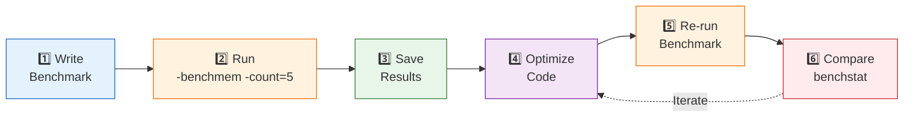

# **Benchmark**
Benchmark is a tool used to measure code perference, telling you how fast your code runs and how much memory it uses.

## Basic structure
```
// xxx_test.go
package xxx

func BenchmarkFuncName(b *testing.B) {
    // optional： Initialization
    setup()

    b.ResetTimer() // reset the timer to exclude the initialization time

    for i := range b.N {
        // code under test
        funcToTest()
    }
}

// subtest
func BenchmarkConcat(b *testing.B) {
    sizes := []{10, 100, 1000}

    for _, size := range sizes {
        b.Run(fmt.Sprint("size=%d", size), func(b *testing.B) {
            for i := range b.N {
                concat(size)
            }
        })
    }
}

// parallel testing
func BenchnarkParallel(b *testing.B) {
    b.RunParallel(func(pb *testing.PB) {
        for pb.Next() {
            doWork()
        }
    })
}
```
Key Points:
* the filename must end with `_test.go`
* the function name must start with `Benchmark`
* the parameter must be `*testing.B`
* Loop b.N times (the frame automatically adjust the value of N)

## run Benchamark
```
# run all benchmark
go test -bench=.

# run a special benchmark
go test -bench=BenchmarkFuncName

# regular match
go test -bench="Concat"

# specify run time
go test -bench=. -benchtime=5s

# specify the number of runs
go test -bench=. -benchtime=1000x

# take the average after multiple runs
go test -bench=. -count=5
```
## benchmem: memory analysis
```
go test -bench=. -benchmem
```

**Output interpretation**
**Benchmark 输出格式解析：**

```
BenchmarkConcat-8    5000000    300 ns/op    64 B/op    2 allocs/op
```

| 字段 | 示例值 | 说明 |
|------|--------|------|
| 函数名 | `BenchmarkConcat` | 被测试的 Benchmark 函数 |
| CPU 核心数 | `-8` | GOMAXPROCS 值（并行度） |
| 运行次数 | `5000000` | 函数被调用的总次数 |
| 每次耗时 | `300 ns/op` | 单次操作平均耗时 |
| 每次分配字节 | `64 B/op` | 单次操作分配的内存（需 `-benchmem`） |
| 每次分配次数 | `2 allocs/op` | 单次操作的内存分配次数（需 `-benchmem`） |

> 💡 **优化目标**：降低 `ns/op`、`B/op`、`allocs/op` 三个指标

## generate profile
```
# generate CPU profile
go test -bench=. -cpuprofile=cpu.pprof

# generate memory profile
go test -bench=. -memprofile=mem.pprof

# analysis
go tool pprof cpu.pprof
go tool pprof mem.pprof
```

## comparesion tool benchstat
```
# install
go install golang.org/x/perf/cmd/benchstat@latest

# run the program multiple times and save the results
go test -bench=. -count=10 > old.txt

# Run it again after optimization
go test -bench=. -count=10 > new.txt

# Comparison
benchstat old.txt new.txt
```

## Best practices
### Benchmark Best Practices

| # | Practice | Command / Code | Purpose |
|---|----------|----------------|---------|
| 1️⃣ | Always use `-benchmem` | `go test -bench=. -benchmem` | Check memory allocations |
| 2️⃣ | Use `b.ResetTimer()` | `b.ResetTimer()` | Exclude initialization time |
| 3️⃣ | Run multiple times | `go test -bench=. -count=5` | Calculate stable average |
| 4️⃣ | Compare results | `benchstat old.txt new.txt` | Validate optimization |

**Complete Benchmark Workflow:**



**Example Commands:**

```bash
# Run benchmark with memory stats, 5 iterations
go test -bench=. -benchmem -count=5 | tee old.txt

# After optimization, run again
go test -bench=. -benchmem -count=5 | tee new.txt

# Compare results
benchstat old.txt new.txt
```