# methodologies and common bottlenecks
## The golden rules of optimization
### Three Principles of Optimization

```mermaid
flowchart LR
    subgraph principles["🎯 Optimization Principles"]
        direction TB
        P1["1️⃣ Don't Optimize Prematurely"]
        P2["2️⃣ Measure First, Then Optimize"]
        P3["3️⃣ Optimize Hotspots"]
    end

    P1 -.- D1["✅ Get the code working correctly first"]
    P2 -.- D2["📊 Let data speak, don't rely on guesswork"]
    P3 -.- D3["🔥 80% time spent on 20% code"]

    style P1 fill:#e3f2fd,stroke:#1565c0
    style P2 fill:#fff3e0,stroke:#ef6c00
    style P3 fill:#ffebee,stroke:#c62828
```



| # | Principle | Description | Anti-Pattern |
|---|-----------|-------------|--------------|
| 1️⃣ | **Don't Optimize Prematurely** | Get the code working correctly first | Micro-optimizing before profiling |
| 2️⃣ | **Measure First** | Let data speak for itself, don't guess | Optimizing based on intuition |
| 3️⃣ | **Optimize Hotspots** | 80% of time is spent on 20% of code | Optimizing cold paths |

> 💡 *"Premature optimization is the root of all evil."* — Donald Knuth

## Optimize process
### Performance Optimization Process

```mermaid
flowchart TD
    START["🚀 Performance Optimization"] --> S1
    
    S1["1️⃣ Define Goals"]
    S1D["latency < 10ms, QPS > 10000"]
    
    S2["2️⃣ Measure Status"]
    S2D["Benchmark / pprof / monitor"]
    
    S3["3️⃣ Locate Bottlenecks"]
    S3D["CPU? Memory? I/O? Lock?"]
    
    S4["4️⃣ Analyze Reasons"]
    S4D["Why slow?"]
    
    S5["5️⃣ Implement Optimization"]
    S5D["Modify code"]
    
    S6["6️⃣ Verify Effect"]
    S6D["Compare before & after"]
    
    S1 --> S1D --> S2
    S2 --> S2D --> S3
    S3 --> S3D --> S4
    S4 --> S4D --> S5
    S5 --> S5D --> S6
    S6 --> S6D
    S6D -.->|"Goal not met? Iterate"| S2

    style S1 fill:#e3f2fd,stroke:#1565c0
    style S2 fill:#fff3e0,stroke:#ef6c00
    style S3 fill:#ffebee,stroke:#c62828
    style S4 fill:#f3e5f5,stroke:#7b1fa2
    style S5 fill:#e8f5e9,stroke:#2e7d32
    style S6 fill:#e0f7fa,stroke:#00838f
```



| Step | Action | Tools / Methods |
|------|--------|-----------------|
| 1️⃣ Define Goals | Set measurable targets | SLA, latency P99, QPS, memory limit |
| 2️⃣ Measure Status | Collect performance data | `go test -bench`, `pprof`, Prometheus |
| 3️⃣ Locate Bottlenecks | Identify problem areas | CPU profile, heap profile, trace |
| 4️⃣ Analyze Reasons | Root cause analysis | Flame graph, call graph, code review |
| 5️⃣ Implement | Apply optimizations | Refactor, cache, concurrency, algorithms |
| 6️⃣ Verify | Compare results | `benchstat`, A/B testing, monitoring |

## Common types of bottlenecks
### Performance Bottleneck Classification

| Category | Symptoms | Common Causes | Diagnostic Tools |
|----------|----------|---------------|------------------|
| 🔥 **CPU** | High CPU usage, slow response | Computation intensive, serialization, regex, encryption/decryption | `pprof cpu`, `top`, `perf` |
| 💾 **Memory** | High memory usage, frequent GC | Frequent allocation, large objects, memory leaks | `pprof heap`, `pprof allocs` |
| 📡 **I/O** | High latency, low throughput | Disk read/write, network requests, database queries | `pprof block`, `strace`, `tcpdump` |
| 🔒 **Concurrent** | Timeouts, deadlocks | Lock contention, channel blocking, goroutine leaks | `pprof mutex`, `pprof goroutine`, `trace` |

```mermaid
flowchart LR
    subgraph bottlenecks["🔍 Bottleneck Identification"]
        direction TB
        CPU["🔥 CPU Bound"]
        MEM["💾 Memory Bound"]
        IO["📡 I/O Bound"]
        LOCK["🔒 Concurrency Bound"]
    end
    
    CPU --> C1["Optimize algorithms"]
    CPU --> C2["Reduce serialization"]
    
    MEM --> M1["Object pooling"]
    MEM --> M2["Reduce allocations"]
    
    IO --> I1["Async / batch"]
    IO --> I2["Caching"]
    
    LOCK --> L1["Reduce lock scope"]
    LOCK --> L2["Lock-free structures"]

    style CPU fill:#ffebee,stroke:#c62828
    style MEM fill:#e3f2fd,stroke:#1565c0
    style IO fill:#fff3e0,stroke:#ef6c00
    style LOCK fill:#f3e5f5,stroke:#7b1fa2
```



## CPU bottleneck
Diagnosis
```
go tool pprof http://localhost:8080/debug/pprof/profile?seconds=30
```

FAQ and optimization
|question|optimization plan|
|---|---|
|Frequent serialization|use faster libraries|
|Regular match|Pre-compiled regular expressions, or use string functions instead|
|reflection operation|Buffered reflection results or generated using code |
|encryption/decryption|use hardware acceleration or reduce the encryption scope|
|Repeated calculations in a loop|Extract to outside the loop|

## Memory bottleneck
Diagnosis
```
# current heap
go tool pprof http://localhost:8080/debug/pprof/heap

# assign hotspots
go tool pprof -alloc_space http://localhost:8080/debug/pprof/heap
```

FAQ and optimization
|question|optimization plan|
|---|---|
|Frequent allocation of temporary objects|use sync.Pool to reuse objects|
|slice expansion|Preallocated capacity|
|String concatenation|strings.Builder |
|lots of small objects|structure merging, array instead of slice|
|Escape to the heap|reduce pointers, replace pointers with return values|

## IO bottleneck
diagnosis
```
# trace analysis
curl -o trace.out http://localhost:8080/debug/pprof/trace?seconds=5
go tool trace trace.out

# blocking analysis
go tool pprof http://localhost:8080/debug/pprof/block
```

FAQ and optimization
|question|optimization plan|
|---|---|
|Synchronous IO|change to asynchronous/concurrent|
|Frequent small request|batch merging|
|No buffering|Increase buffer |
|N+1 query|batch query|
|Serial request|change to parallel requests|

## parallel bottleneck
Diagnosis
```
# lock contention
go tool pprof http://localhost:8080/debug/pprof/mutex

# goroutine status
curl http://localhost:8080/debug/pprof/goroutine?debug=1

# blocking analysis
go tool pprof http://localhost:8080/debug/pprof/block
```

FAQ and optimization
|question|optimization plan|
|---|---|
|Global lock contention|Segmented lock or unlockless structure|
|Lock granularity is too large|reduce critical area|
|channel blocking|use a buffered channel|
|goroutine leak|contest cancel, timeout|
|too many goroutine|use work pool|

## GC bottleneck
diagnosis
```
GODEBUG=gctrace=1 ./app
```
FAQ and optimization
|question|optimization plan|
|---|---|
|Frequent GC|increase the value of GOGC|
|the time of STW is long|reduce live objects |
|Memory grows quickly|reuse objects, reduce object allocate|

## Quick location tool
### Problems → Tools Quick Reference

| Problem | Tool | Command |
|---------|------|---------|
| 🔥 CPU High | pprof cpu | `go tool pprof http://localhost:6060/debug/pprof/profile?seconds=30` |
| 💾 Memory High | pprof heap | `go tool pprof http://localhost:6060/debug/pprof/heap` |
| 📈 Memory Leak | pprof allocs + diff | `go tool pprof -diff_base=old.pb.gz new.pb.gz` |
| ⏱️ Latency Jitter | trace | `go tool trace trace.out` |
| 🔒 Lock Contention | pprof mutex | `go tool pprof http://localhost:6060/debug/pprof/mutex` |
| 🔄 Too Many Goroutines | pprof goroutine | `go tool pprof http://localhost:6060/debug/pprof/goroutine` |
| ⏸️ Blocking | pprof block | `go tool pprof http://localhost:6060/debug/pprof/block` |
| 🗑️ GC Issues | gctrace | `GODEBUG=gctrace=1 ./your_program` |

**Enable pprof in your code:**

```go
import _ "net/http/pprof"

func main() {
    go func() {
        http.ListenAndServe(":6060", nil)
    }()
    // your application code
}
```

## optimization checklist
| # | Checkpoint | Question | Evidence |
|---|------------|----------|----------|
| ☐ | 🎯 Goals | Are there clear performance goals? | SLA, latency P99, QPS targets |
| ☐ | 📊 Measurement | Has the true bottleneck been measured? | pprof results, flame graph |
| ☐ | 🔥 Hotspot | Is the optimization targeting hotspot paths? | Top functions in profile |
| ☐ | ✅ Verification | Is there a benchmark to verify the effect? | Before/after benchstat |
| ☐ | 🧹 Maintainability | Is the optimized code maintainable? | Code review approved |
| ☐ | 🔲 Edge Cases | Have boundary cases been considered? | Unit tests pass |

> ⚠️ **Before merging any optimization PR, ensure all checkboxes are verified!**

## Summarize
### Performance Optimization Core Summary


| Aspect | Content |
|--------|---------|
| **Methodology** | Measure → Locate → Analyze → Optimize → Verify → (Iterate) |
| **Tool Chain** | `Benchmark` + `pprof` + `trace` + `gctrace` |
| **Priority** | Algorithm > I/O > Concurrent > Memory > Micro-optimization |
| **Principles** | 📊 Data-driven · 🔥 Focus on hotspots · 🎯 Keep it simple |

> 💡 **Remember**: The biggest performance gains come from algorithmic improvements, not micro-optimizations!