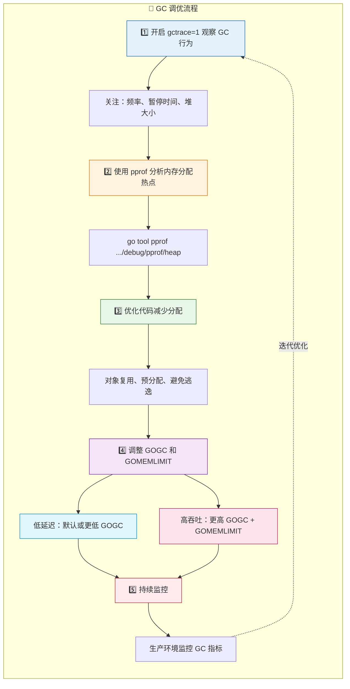

# **GC**
Golang的GC经过长时间的发展，已经从最初的秒级别减少到微妙级别，其核心实现是三色标记法和混合写屏障

## 三色标记法
核心是使用三种颜色来表示内存状态：
* 白色：未访问
* 黑色：已完成扫描
* 灰色：代扫描

写屏障：用来保证黑色对象不直接指向白色对象（维护不变式）

流程：
1. 开启写屏障，并扫描栈，全局变量和寄存器（STW）
2. 并发扫描
3. 关闭写屏障，准备清扫（STW)
4. 清扫内存

触发时机：
1. 超出堆内存阈值
2. 定时触发
3. 手动触发

如何调优：
1. 相关参数：
### GC 配置参数

| 参数 | 默认值 | 说明 | 示例 |
|------|--------|------|------|
| `GOGC` | 100 | 堆增长比例阈值，触发 GC | `GOGC=200`（减少 GC 频率） |
| `GOGC=off` | - | 关闭 GC | 仅用于特殊场景 |
| `GOMEMLIMIT` | 无限制 | 内存硬上限，达到后触发 GC | `GOMEMLIMIT=1GiB` |
| `debug.SetGCPercent()` | - | 运行时动态调整 GOGC | `debug.SetGCPercent(200)` |

### GC 追踪

```bash
# 开启 GC 追踪
GODEBUG=gctrace=1 ./app

# 开启调度追踪（每 1000ms 输出一次）
GODEBUG=schedtrace=1000 ./app
```

**gctrace 输出格式解析：**

```
gc 1 @0.012s 2%: 0.026+1.0+0.019 ms clock, 0.21+0.98/1.8/0.26+0.15 ms cpu, 4->4->1 MB, 5 MB goal, 8 P
```

| 字段 | 示例值 | 说明 |
|------|--------|------|
| GC 次数 | `gc 1` | 第 1 次 GC |
| 启动时间 | `@0.012s` | 程序启动后 0.012 秒 |
| CPU 占比 | `2%` | GC 占用总 CPU 时间的百分比 |
| 墙钟时间 | `0.026+1.0+0.019 ms` | STW₁ + 并发标记 + STW₂ |
| CPU 时间 | `0.21+0.98/1.8/0.26+0.15 ms` | 各阶段 CPU 时间分解 |
| 堆变化 | `4->4->1 MB` | GC 前 → 标记后 → GC 后 |
| 目标堆 | `5 MB goal` | 下次 GC 触发的目标堆大小 |
| P 数量 | `8 P` | GOMAXPROCS 值 |

2. 调优流程


**GC 调优速查表：**

| 步骤 | 工具/方法 | 目标 |
|------|-----------|------|
| 1. 观察 | `GODEBUG=gctrace=1` | 了解 GC 频率、暂停时间 |
| 2. 分析 | `pprof heap` | 定位内存分配热点 |
| 3. 优化 | 代码重构 | 减少分配、对象复用 |
| 4. 调参 | `GOGC` / `GOMEMLIMIT` | 平衡延迟与吞吐 |
| 5. 监控 | Prometheus + Grafana | 持续观察生产环境 |

**场景选择：**

| 场景 | GOGC | GOMEMLIMIT | 说明 |
|------|------|------------|------|
| 低延迟 | 50~100 | 不设置 | 更频繁 GC，减少暂停 |
| 高吞吐 | 200~400 | 设置上限 | 减少 GC 次数，提高吞吐 |
| 内存受限 | 100 | 严格限制 | 防止 OOM |
| 内存受限 | 100 | 严格限制 | 防止 OOM |