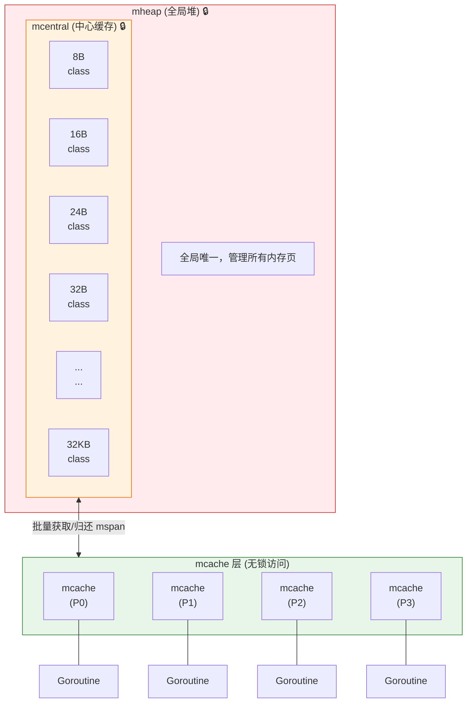
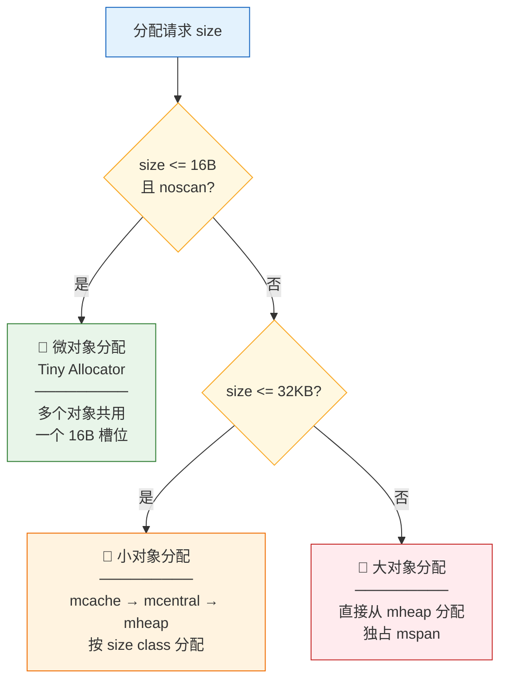
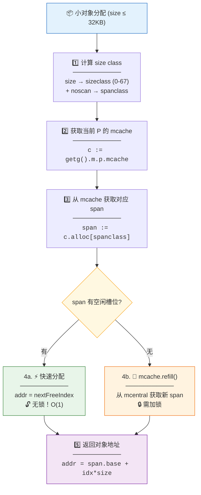
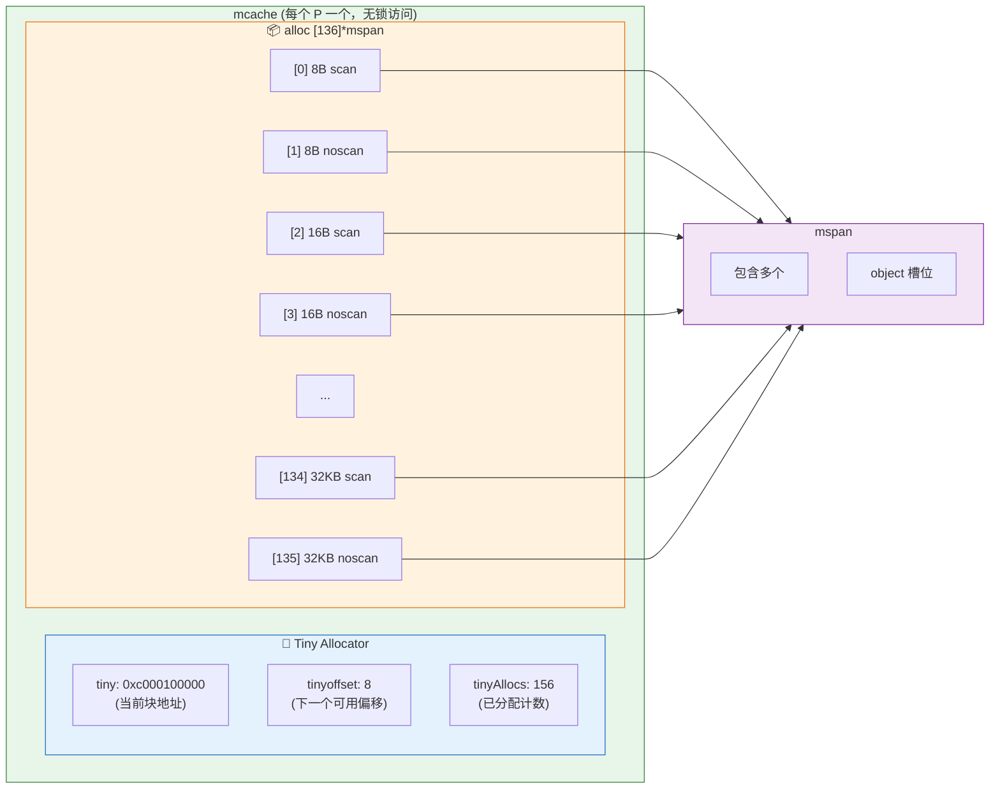
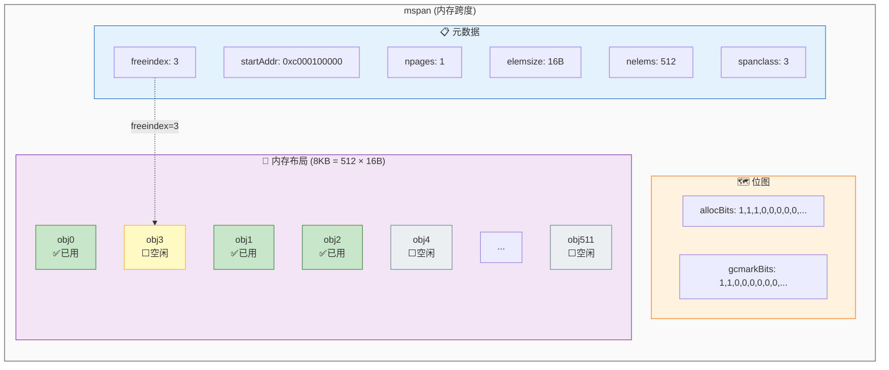
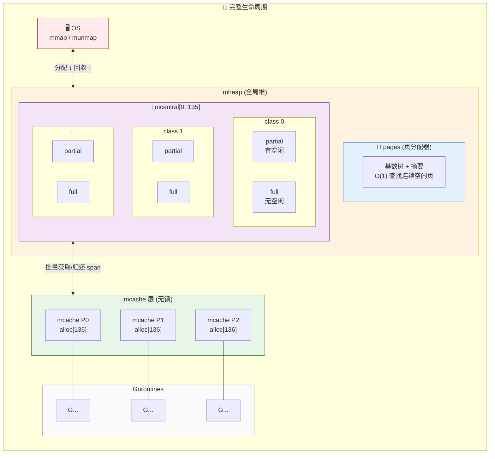
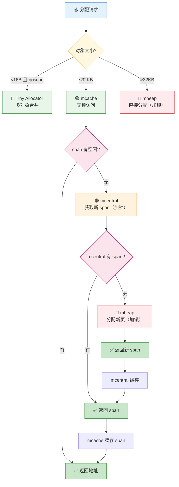
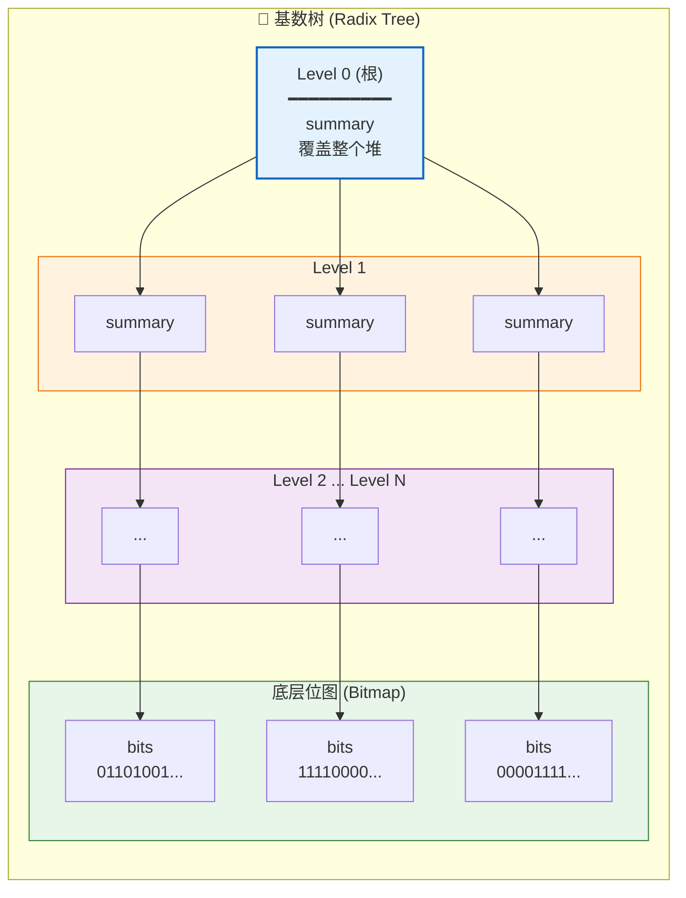
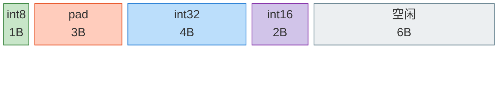

# **Memory allocator**
The memory allocator of Golang is based on the Google's TCMalloc design, optimised for multi-core and high-concurrency scenarios.

## core design philosophy

|design | purpose |
|------|-----|
|multi-level cache|reduce lock contention|
|size classification| reduce memory fragmentation|
|batch operation|amortize allocation cost|
|thread-local cache|lock-free fast path|

## 整体架构

**层级说明：**

| 层级 | 组件 | 锁机制 | 说明 |
|------|------|--------|------|
| L1 | mheap | 全局锁 | 管理所有内存页，向 OS 申请/释放内存 |
| L2 | mcentral | 每个 size class 一把锁 | 68 个 size class，管理 mspan 链表 |
| L3 | mcache | **无锁** | 每个 P 一个，Goroutine 直接访问 |

## 分配决策流程

**分配阈值：**

| 类型 | 大小范围 | 分配路径 | 特点 |
|------|----------|----------|------|
| 微对象 | ≤16B 且 noscan | Tiny Allocator | 多对象合并，减少碎片 |
| 小对象 | 16B < size ≤ 32KB | mcache → span | 按 68 个 size class 分配 |
| 大对象 | > 32KB | 直接 mheap | 独占一个或多个 mspan |

## 小对象分配详细流程

**关键路径对比：**

| 路径 | 锁机制 | 时间复杂度 | 触发条件 |
|------|--------|------------|----------|
| 快速路径 (4a) | 无锁 | O(1) | span 有空闲槽位 |
| 慢速路径 (4b) | mcentral 锁 | O(1)~O(n) | span 已满，需 refill |

## mcache 结构

**mcache 字段说明：**

| 字段 | 类型 | 说明 |
|------|------|------|
| `tiny` | `uintptr` | 当前 tiny 块地址，用于 ≤16B 且 noscan 的对象 |
| `tinyoffset` | `uintptr` | tiny 块内下一个可用偏移 |
| `tinyAllocs` | `uintptr` | tiny 分配计数（用于统计） |
| `alloc` | `[136]*mspan` | 68 个 size class × 2（scan/noscan）= 136 个 span 指针 |

## mspan 结构

**mspan 字段说明：**

| 字段 | 类型 | 说明 |
|------|------|------|
| `startAddr` | `uintptr` | span 起始内存地址 |
| `npages` | `uintptr` | 占用的页数（每页 8KB） |
| `elemsize` | `uintptr` | 每个 object 的大小 |
| `nelems` | `uintptr` | object 总数 = npages × 8KB / elemsize |
| `freeindex` | `uintptr` | 下一个可能空闲的 object 索引（快速定位） |
| `spanclass` | `spanClass` | size class × 2 + noscan（0 或 1） |
| `allocBits` | `*gcBits` | 分配位图：1=已分配，0=空闲 |
| `gcmarkBits` | `*gcBits` | GC 标记位图：1=存活，0=待回收 |

## 分配与回收完整流程

**内存流动方向：**

| 操作 | 方向 | 路径 |
|------|------|------|
| **分配** | ↓ 向下 | OS → mheap → mcentral → mcache → Goroutine |
| **回收** | ↑ 向上 | Goroutine → mcache → mcentral → mheap → OS |

**mcentral 双链表：**

| 链表 | 说明 | 用途 |
|------|------|------|
| `partial` | 有空闲槽位的 span | mcache 优先从此获取 |
| `full` | 无空闲槽位的 span | GC 后可能转为 partial |

## Size Class 表（部分）

| Class | 对象大小 | span 页数 | 对象个数 | 浪费率 |
|-------|---------|----------|---------|--------|
| 1 | 8B | 1 | 1024 | 12.5% |
| 2 | 16B | 1 | 512 | 6.25% |
| 3 | 24B | 1 | 341 | 4.17% |
| 4 | 32B | 1 | 256 | 3.13% |
| 5 | 48B | 1 | 170 | 2.08% |
| 6 | 64B | 1 | 128 | 1.56% |
| ... | ... | ... | ... | ... |
| 67 | 32KB | 4 | 1 | ~0% |

> × 2 (scan/noscan) = 136 种 spanClass

## 一图总结

**分配路径与锁机制：**

| 路径 | 锁机制 | 触发条件 | 性能 |
|------|--------|----------|------|
| Tiny | 无锁 | <16B 且 noscan | ⚡ 最快 |
| mcache 快速路径 | 无锁 | span 有空闲槽位 | ⚡ 极快 |
| mcentral 回填 | size class 锁 | mcache span 已满 | 🔸 较快 |
| mheap 分配 | 全局锁 | mcentral 无可用 span | 🔺 最慢 |
| 大对象直接分配 | 全局锁 | size > 32KB | 🔺 最慢 |

## 页分配器（Go 1.14+）

使用**基数树 + 位图 + 摘要**实现 O(1) 页查找：

**基数树查找原理：**

| 层级 | 内容 | 作用 |
|------|------|------|
| Level 0 | 根 summary | 记录整个堆的最大连续空闲页数 |
| Level 1~N | 子 summary | 记录子树的最大连续空闲页数 |
| 底层 | Bitmap | 每个 bit 表示一个页的状态（0=空闲，1=已用） |

**O(1) 查找流程：**
1. 从根 summary 快速判断是否有足够连续空闲页
2. 沿着满足条件的子树向下搜索
3. 在底层 bitmap 中定位具体页位置

**摘要 (pallocSum)** 编码三个值到一个 uint64：
- `start`: 从左边开始的连续空闲页数
- `max`: 区域内最大连续空闲页数
- `end`: 从右边开始的连续空闲页数

通过 `max` 可以 **O(1) 判断**该区域能否满足 n 页的需求。

## scan vs noscan

| 类型 | 含义 | GC 需要扫描内部 |
|------|------|----------------|
| scan | 对象内部有指针 | ✅ 需要 |
| noscan | 对象内部无指针 | ❌ 跳过 |

分离存储的好处：GC 可以**整个跳过 noscan span**，减少扫描开销。

## 微对象分配 (Tiny Allocator)

条件：`size < 16B && noscan`

**Tiny 块布局 (16B)：**

| 偏移 | 大小 | 内容 | 说明 |
|------|------|------|------|
| 0 | 1B | `int8` | 第 1 个对象 |
| 1 | 3B | padding | 对齐填充（int32 需 4 字节对齐） |
| 4 | 4B | `int32` | 第 2 个对象 |
| 8 | 2B | `int16` | 第 3 个对象 |
| 10 | 6B | 空闲 | `tinyoffset = 10`，剩余空间 |

> 💡 Tiny Allocator 将多个 ≤16B 且 noscan 的小对象合并到同一个 16B 槽位，减少内存碎片

- 多个微对象共用一个 16B 槽位
- 使用 `tinyoffset` 追踪下一个可用位置
- 不区分内部边界，整个块作为一个整体管理

# **Go 逃逸分析原理**
逃逸分析是编译器在编译期判断变量应该分配到堆上还是栈上的技术，核心决策方法是：变量的生命周期是否小于函数的生命周期，小于就分配栈上，否则分配到堆上

## 典型场景
* 返回局部变量的指针
* 分配一个大的数据，导致栈空间不足
* 向chan存入指针对象
* 闭包变量
* 动态分发对象
* 切片和map存储指针

## 查看逃逸分析的结果
* go build -gcflags="-m" main.go
* go build -gcflags="-m -m" main.go
* go build -gcflags="-m" ./...

