# **TCP/IP Networking Stack**

## The Four-layer Model


## Layer Responsibilities
|layer|responsibilities|protocol|data unit|
|---|---|---|---|
|application|provide services to applications|HTTP,DNS,FTP|message/data|
|transaction|End-to-End communication|TCP,UDP|Segment|
|Internet|Routing&Addressing|IP, ICMP|Packet|
|Network Interface|Physical Transmission|Ethernet|Frame|

## Data Encapsulation Process

```mermaid
flowchart TB
    subgraph Encapsulation["Data Encapsulation Process"]
        direction TB
        
        A["<b>Application Layer</b><br/>[ Data ]"]
        
        A -->|"Add TCP/UDP Header"| B
        
        B["<b>Transport Layer</b><br/>[ TCP Header | Data ]"]
        
        B -->|"Add IP Header"| C
        
        C["<b>Internet Layer</b><br/>[ IP Header | TCP Header | Data ]"]
        
        C -->|"Add Frame Header & Trailer"| D
        
        D["<b>Network Interface Layer</b><br/>[ Frame Header | IP Header | TCP Header | Data | Frame Trailer ]"]
        
        D -->|"Physical Signal"| E
        
        E["<b>Network Transmission</b><br/>→ Receiver decapsulates layer by layer"]
    end

    style A fill:#e1f5fe
    style B fill:#fff3e0
    style C fill:#f3e5f5
    style D fill:#e8f5e9
    style E fill:#fce4ec
```


## Core Protocol Explain
1. IP protocol(Internet Layer)
IP header (20 bytes)
### IP Header (20 bytes)

```
    0                   1                   2                   3
    0 1 2 3 4 5 6 7 8 9 0 1 2 3 4 5 6 7 8 9 0 1 2 3 4 5 6 7 8 9 0 1
   +-+-+-+-+-+-+-+-+-+-+-+-+-+-+-+-+-+-+-+-+-+-+-+-+-+-+-+-+-+-+-+-+
   |Version|  IHL  |    ToS        |          Total Length         |
   +-+-+-+-+-+-+-+-+-+-+-+-+-+-+-+-+-+-+-+-+-+-+-+-+-+-+-+-+-+-+-+-+
   |         Identification        |Flags|      Fragment Offset    |
   +-+-+-+-+-+-+-+-+-+-+-+-+-+-+-+-+-+-+-+-+-+-+-+-+-+-+-+-+-+-+-+-+
   |  TTL  |    Protocol   |         Header Checksum               |
   +-+-+-+-+-+-+-+-+-+-+-+-+-+-+-+-+-+-+-+-+-+-+-+-+-+-+-+-+-+-+-+-+
   |                       Source IP Address                       |
   +-+-+-+-+-+-+-+-+-+-+-+-+-+-+-+-+-+-+-+-+-+-+-+-+-+-+-+-+-+-+-+-+
   |                    Destination IP Address                     |
   +-+-+-+-+-+-+-+-+-+-+-+-+-+-+-+-+-+-+-+-+-+-+-+-+-+-+-+-+-+-+-+-+
```

| Field | Bits | Description |
|-------|------|-------------|
| Version | 4 | IP version (4 for IPv4) |
| IHL | 4 | Header length in 32-bit words |
| ToS | 8 | Type of Service / DSCP |
| Total Length | 16 | Total packet length in bytes |
| Identification | 16 | Fragment identification |
| Flags | 3 | DF (Don't Fragment), MF (More Fragments) |
| Fragment Offset | 13 | Position of fragment in original packet |
| **TTL** | 8 | Time To Live - decremented at each hop |
| **Protocol** | 8 | Upper layer protocol (6=TCP, 17=UDP, 1=ICMP) |
| Header Checksum | 16 | Header error checking |
| Source IP | 32 | Sender's IP address |
| Destination IP | 32 | Receiver's IP address |

2. TCP Protocol(Transaction Layer)
### TCP Header (20 bytes + options)

```
    0                   1                   2                   3
    0 1 2 3 4 5 6 7 8 9 0 1 2 3 4 5 6 7 8 9 0 1 2 3 4 5 6 7 8 9 0 1
   +-+-+-+-+-+-+-+-+-+-+-+-+-+-+-+-+-+-+-+-+-+-+-+-+-+-+-+-+-+-+-+-+
   |          Source Port          |       Destination Port        |
   +-+-+-+-+-+-+-+-+-+-+-+-+-+-+-+-+-+-+-+-+-+-+-+-+-+-+-+-+-+-+-+-+
   |                        Sequence Number                        |
   +-+-+-+-+-+-+-+-+-+-+-+-+-+-+-+-+-+-+-+-+-+-+-+-+-+-+-+-+-+-+-+-+
   |                    Acknowledgment Number                      |
   +-+-+-+-+-+-+-+-+-+-+-+-+-+-+-+-+-+-+-+-+-+-+-+-+-+-+-+-+-+-+-+-+
   |  Data |       |U|A|P|R|S|F|                                   |
   | Offset| Rsrvd |R|C|S|S|Y|I|            Window Size            |
   |  (4)  |  (6)  |G|K|H|T|N|N|                                   |
   +-+-+-+-+-+-+-+-+-+-+-+-+-+-+-+-+-+-+-+-+-+-+-+-+-+-+-+-+-+-+-+-+
   |           Checksum            |         Urgent Pointer        |
   +-+-+-+-+-+-+-+-+-+-+-+-+-+-+-+-+-+-+-+-+-+-+-+-+-+-+-+-+-+-+-+-+
   |                    Options (if any)                           |
   +-+-+-+-+-+-+-+-+-+-+-+-+-+-+-+-+-+-+-+-+-+-+-+-+-+-+-+-+-+-+-+-+
```

| Field | Bits | Description |
|-------|------|-------------|
| Source Port | 16 | Sender's port number |
| Destination Port | 16 | Receiver's port number |
| Sequence Number | 32 | Byte position in data stream |
| Acknowledgment Number | 32 | Next expected byte from sender |
| Data Offset | 4 | Header length in 32-bit words |
| Reserved | 6 | Reserved for future use |
| Window Size | 16 | Receive window size (flow control) |
| Checksum | 16 | Header + data error checking |
| Urgent Pointer | 16 | Offset to urgent data |

### TCP Flags

| Flag | Name | Description |
|------|------|-------------|
| **SYN** | Synchronize | Initiate connection (three-way handshake) |
| **ACK** | Acknowledgment | Confirms received data |
| **FIN** | Finish | Gracefully close connection |
| **RST** | Reset | Abort connection immediately |
| **PSH** | Push | Deliver data to application immediately |
| **URG** | Urgent | Urgent data present (use Urgent Pointer) |

3. UDP Protocol(Transaction Layer)
### UDP Header (8 bytes)

```
    0                   1                   2                   3
    0 1 2 3 4 5 6 7 8 9 0 1 2 3 4 5 6 7 8 9 0 1 2 3 4 5 6 7 8 9 0 1
   +-+-+-+-+-+-+-+-+-+-+-+-+-+-+-+-+-+-+-+-+-+-+-+-+-+-+-+-+-+-+-+-+
   |          Source Port          |       Destination Port        |
   +-+-+-+-+-+-+-+-+-+-+-+-+-+-+-+-+-+-+-+-+-+-+-+-+-+-+-+-+-+-+-+-+
   |            Length             |           Checksum            |
   +-+-+-+-+-+-+-+-+-+-+-+-+-+-+-+-+-+-+-+-+-+-+-+-+-+-+-+-+-+-+-+-+
```

| Field | Bits | Description |
|-------|------|-------------|
| Source Port | 16 | Sender's port number |
| Destination Port | 16 | Receiver's port number |
| Length | 16 | Header + data length in bytes |
| Checksum | 16 | Optional error checking (IPv4) |

### UDP Characteristics

| Feature | Description |
|---------|-------------|
| **Connectionless** | No handshake required, send immediately |
| **Unreliable** | No delivery guarantee, no retransmission |
| **No Congestion Control** | Sends at any rate regardless of network |
| **Low Overhead** | Only 8 bytes header (vs TCP's 20+ bytes) |
| **High Speed** | Ideal for real-time: DNS, VoIP, Gaming, Streaming |

## TCP vs UDP
|feature|TCP|UDP|
|---|---|---|
|connection|connection-oriented|connectionless|
|reliability|reliable connection|unreliable|
|sequence|Guaranteed order|out-of-order|
|Flow Control|Yes|No|
|Congestion Control|Yes|No|
|header size|20+ bytes|8 bytes|
|scenario|HTTP, file transactions|vedio,DNS|

## TCP three-way handshake


## TCP four-way handshake


## TCP state machine


## TCP Flow Control

### Purpose
To prevent the sender from transmitting data too fast and overwhelming the receiver.
It is mainly an End-to-End mechanism limited by the receiver's processing and buffering capacity.

### Sliding Window Mechanism


### Key Concepts

| Term | Description |
|------|-------------|
| rwnd | Receiver Window - advertised by receiver in ACK |
| Sliding Window | Sender can send data within window without waiting for ACK |
| Zero Window | rwnd=0, sender must stop and wait |
| Window Probe | Sender periodically checks if rwnd > 0 |

## TCP Congestion Control
### purpose
To manage network congestion and optimize throughput.

###state machine

